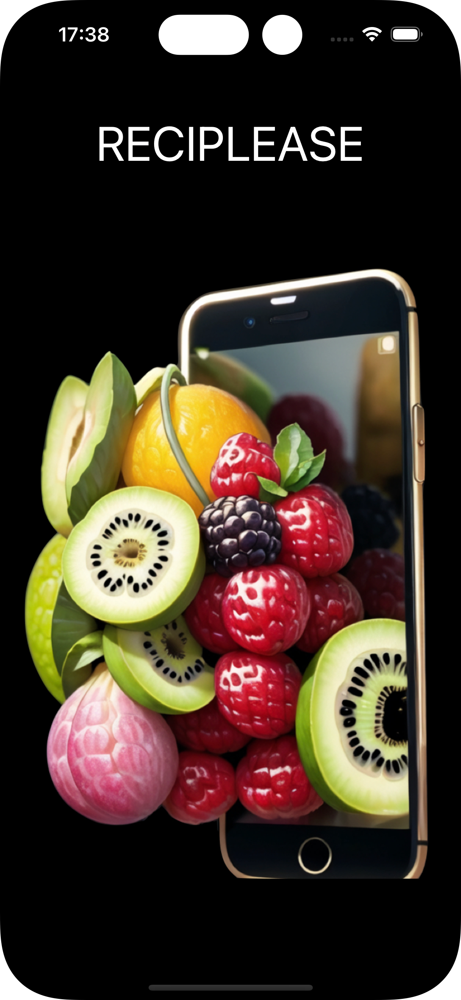
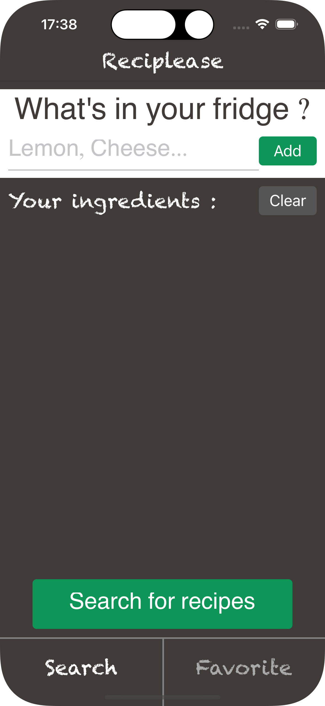
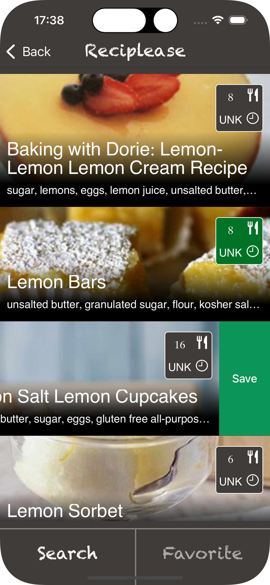
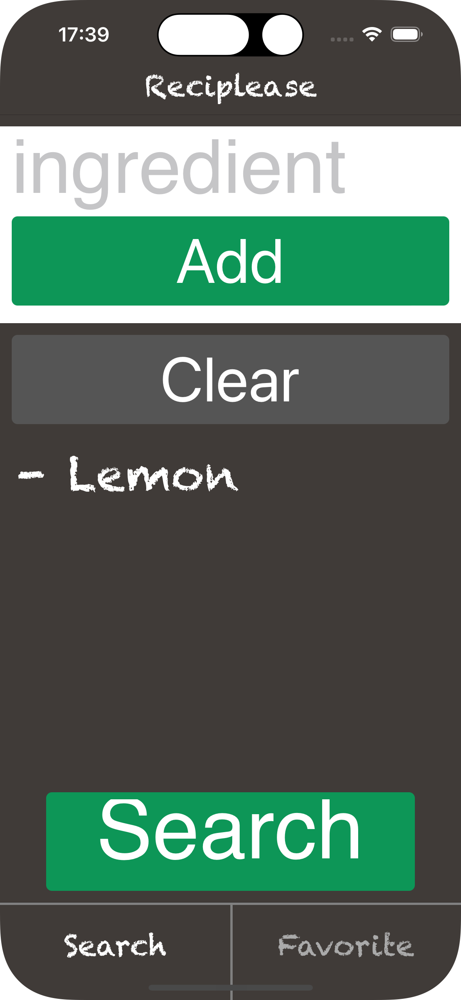

# Reciplease

projet 10 d'OC : création d'une Application de recette

Le projet permet de rechercher une cette suivant une liste d'ingrédients

Pour l'utiliser, il faut crée une clé APi sur le site /
- vous devez vous créer une session sur le site edamam.Com
- sommaire Account
- Go to dashBoard
- Application 
- créate a new application

Coller la clée API dans un fichier APIKey dans le dossier Network
```swift
import Foundation
enum APIKey {
    case recipe

    var key: String {
        switch self {
        case .recipe:
            return "votre key"
        }
    }
    var id: String {
        switch self {
        case .recipe:
            return "votre id"
        }
    }
}
```

Compétences : 
  APi, Green code, Accessibility, SPM, CoreData, MVVM, Unit Test, UI Test

<h3 align="center"></h3><h3 align="center"></h3><h3 align="center"></h3><h3 align="center"></h3>

